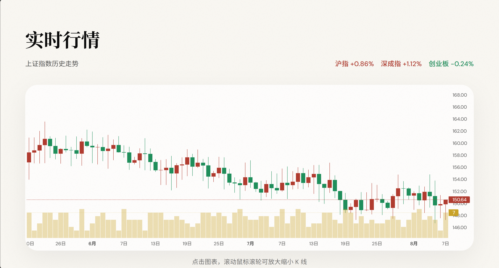

# FINEX - AI 智能股票分析系统

基于 LangGraph 多智能体架构的 A 股智能分析平台，集成 MCP 协议实现多维度股票评估。




## 功能特性

- **多维度分析**：从基本面、技术面、价值面、新闻面四个角度全面评估股票
- **多智能体协作**：基于 LangGraph 的 DAG 工作流，四个分析 Agent 并行执行
- **MCP 协议集成**：通过 Model Context Protocol 统一接入 A 股数据源
- **实时进度追踪**：支持异步任务处理，前端实时轮询分析进度
- **综合报告生成**：AI 自动生成结构化股票分析报告

## 技术架构

```
┌─────────────────────────────────────────────────────────────┐
│                        Frontend                              │
│                   (HTML/CSS/JavaScript)                      │
└─────────────────────────┬───────────────────────────────────┘
                          │ HTTP/WebSocket
                          ▼
┌─────────────────────────────────────────────────────────────┐
│                     FastAPI Backend                          │
│                   (RESTful API)                              │
└─────────────────────────┬───────────────────────────────────┘
                          │
                          ▼
┌─────────────────────────────────────────────────────────────┐
│                   LangGraph Workflow                         │
│  ┌──────────┐ ┌──────────┐ ┌──────────┐ ┌──────────┐       │
│  │基本面Agent│ │技术面Agent│ │价值面Agent│ │新闻面Agent│       │
│  └────┬─────┘ └────┬─────┘ └────┬─────┘ └────┬─────┘       │
│       │            │            │            │              │
│       └────────────┴────────────┴────────────┘              │
│                          │                                   │
│                          ▼                                   │
│                  ┌──────────────┐                           │
│                  │  汇总 Agent   │                           │
│                  └──────────────┘                           │
└─────────────────────────┬───────────────────────────────────┘
                          │
                          ▼
┌─────────────────────────────────────────────────────────────┐
│                    MCP Server                                │
│              (A股数据工具集 - 20+ Tools)                      │
│   实时行情 | 历史K线 | 财务指标 | 资金流向 | ...              │
└─────────────────────────────────────────────────────────────┘
```

## 技术栈

| 类别 | 技术 |
|------|------|
| 后端框架 | FastAPI |
| AI 框架 | LangGraph, LangChain |
| 数据协议 | MCP (Model Context Protocol) |
| 数据源 | Baostock, A股行情接口 |
| LLM | OpenAI 兼容 API (OpenRouter 等) |

## 快速开始

### 环境要求

- Python 3.10+
- uv (Python 包管理器)

### 安装步骤

1. **克隆项目**

```bash
git clone https://github.com/your-username/finex.git
cd finex
```

2. **创建虚拟环境**

```bash
python -m venv venv

# Windows
.\venv\Scripts\activate

# Linux/Mac
source venv/bin/activate
```

3. **安装依赖**

```bash
pip install -r requirements.txt
```

4. **配置环境变量**

```bash
# 复制配置模板
cp agents/.env.example agents/.env

# 编辑 .env 文件，填入你的 API Key
# OPENAI_API_KEY=your-api-key-here
# OPENAI_BASE_URL=https://api.openai.com/v1
```

5. **启动服务**

```bash
# Windows
scripts\start_server.bat

# Linux/Mac
bash scripts/start_server.sh

# 或手动启动
python -m uvicorn backend.server:app --host 0.0.0.0 --port 8100
```

6. **访问应用**

打开浏览器访问 http://localhost:8100

## 项目结构

```
finex/
├── backend/                    # 后端服务
│   └── server.py              # FastAPI 主程序 (REST API + LangGraph 调度)
├── frontend/                   # 前端页面
│   └── index.html             # 单页应用 (Glassmorphism 风格)
├── agents/                     # AI 多智能体系统
│   ├── src/
│   │   ├── main.py            # Agent 编排主入口 (CLI)
│   │   ├── agents/            # 各领域 Agent (基于 create_react_agent)
│   │   │   ├── fundamental_agent.py   # 基本面分析
│   │   │   ├── technical_agent.py     # 技术面分析
│   │   │   ├── value_agent.py         # 价值面分析
│   │   │   ├── news_agent.py          # 新闻面分析
│   │   │   └── summary_agent.py       # 汇总分析 (生成最终报告)
│   │   ├── tools/             # MCP 工具集成
│   │   │   ├── mcp_client.py         # MCP 客户端 (进程级单例)
│   │   │   ├── mcp_config.py         # MCP 服务连接配置
│   │   │   └── openrouter_config.py  # OpenRouter 配置
│   │   └── utils/             # 共享工具模块
│   │       ├── state_definition.py   # AgentState 状态定义 (TypedDict)
│   │       ├── workflow_builder.py   # build_workflow() 工作流工厂
│   │       ├── agent_config.py       # Agent 共享配置 (递归深度/超时/LLM 参数)
│   │       ├── baostock_helper.py    # Baostock 线程安全访问
│   │       ├── stock_extractor.py    # 股票代码/名称提取 (共享模块)
│   │       ├── execution_logger.py   # 执行日志
│   │       ├── llm_clients.py        # LLM 客户端管理
│   │       ├── logging_config.py     # 日志配置
│   │       ├── pdf_converter.py      # Markdown -> PDF 转换
│   │       └── pdf_styles.py         # PDF 样式与解析
│   ├── reports/               # 生成的分析报告 (md/ + pdf/, gitignored)
│   └── .env                   # 环境配置 (gitignored)
├── mcp-server/                 # MCP 数据服务 (A 股行情/财务/宏观数据)
│   ├── mcp_server.py          # MCP 服务器入口 (FastMCP)
│   ├── pyproject.toml         # MCP 服务项目配置
│   ├── src/
│   │   ├── baostock_data_source.py   # Baostock 数据源实现
│   │   ├── data_source_interface.py  # 数据源接口
│   │   ├── utils.py           # Baostock 登录上下文与通用取数
│   │   ├── formatting/        # 数据格式化
│   │   │   └── markdown_formatter.py
│   │   └── tools/             # MCP 工具集
│   │       ├── stock_market.py       # 股票行情工具
│   │       ├── financial_reports.py  # 财务报表工具
│   │       ├── analysis.py           # 分析工具
│   │       ├── indices.py            # 指数工具
│   │       ├── macroeconomic.py      # 宏观经济工具
│   │       ├── market_overview.py    # 市场概览工具
│   │       ├── news_crawler.py       # 新闻爬取工具
│   │       └── date_utils.py         # 日期工具
│   └── tests/                 # MCP 服务测试
│       └── test_crawl_news_no_model.py
├── scripts/                    # 启动脚本
│   ├── start_server.bat       # Windows 启动脚本
│   └── start_server.sh        # Linux/Mac 启动脚本
├── tests/                      # 测试套件
│   ├── test_baostock_concurrency.py   # Baostock 并发安全
│   ├── test_agent_failure_handling.py # Agent 失败处理
│   ├── test_workflow_builder.py       # 工作流工厂拓扑
│   ├── test_stock_extractor.py        # 股票代码提取
│   ├── test_pdf_path.py               # PDF 路径推导
│   ├── test_summary_agent_lazy_torch.py # summary_agent 懒加载
│   └── test_end_to_end.py             # 端到端冒烟测试
├── docs/                       # 设计文档
├── images-README/              # README 截图资源
├── requirements.txt            # Python 依赖 (web 应用核心)
├── AGENTS.md                   # Agent 工作流配置
├── TODO.md                     # 待办事项
└── README.md
```

## API 文档

### 启动分析

```http
POST /api/analyze
Content-Type: application/json

{
  "query": "比亚迪"
}
```

响应：
```json
{
  "analysis_id": "abc12345",
  "status": "started",
  "message": "Analysis started for: 比亚迪"
}
```

### 查询状态

```http
GET /api/status/{analysis_id}
```

响应：
```json
{
  "analysis_id": "abc12345",
  "status": "running",
  "progress": {
    "fundamental": "completed",
    "technical": "running",
    "value": "completed",
    "news": "completed",
    "summary": "waiting"
  }
}
```

### 获取结果

```http
GET /api/result/{analysis_id}
```

### 健康检查

```http
GET /api/health
```

## 支持的股票

支持 A 股主流上市公司，包括但不限于：

- 贵州茅台 (600519)
- 比亚迪 (002594)
- 宁德时代 (300750)
- 中国平安 (601318)
- 招商银行 (600036)
- 腾讯控股 (00700)
- 阿里巴巴 (09988)
- ...

## 配置说明

### 环境变量

| 变量名 | 说明 | 必填 |
|--------|------|------|
| `OPENAI_API_KEY` | OpenAI API Key | 是 |
| `OPENAI_BASE_URL` | API 基础 URL（支持自定义端点） | 否 |
| `OPENAI_MODEL` | 使用的模型名称 | 否 |

## 许可证

本项目仅供学习和研究使用，不构成任何投资建议。股市有风险，投资需谨慎。
